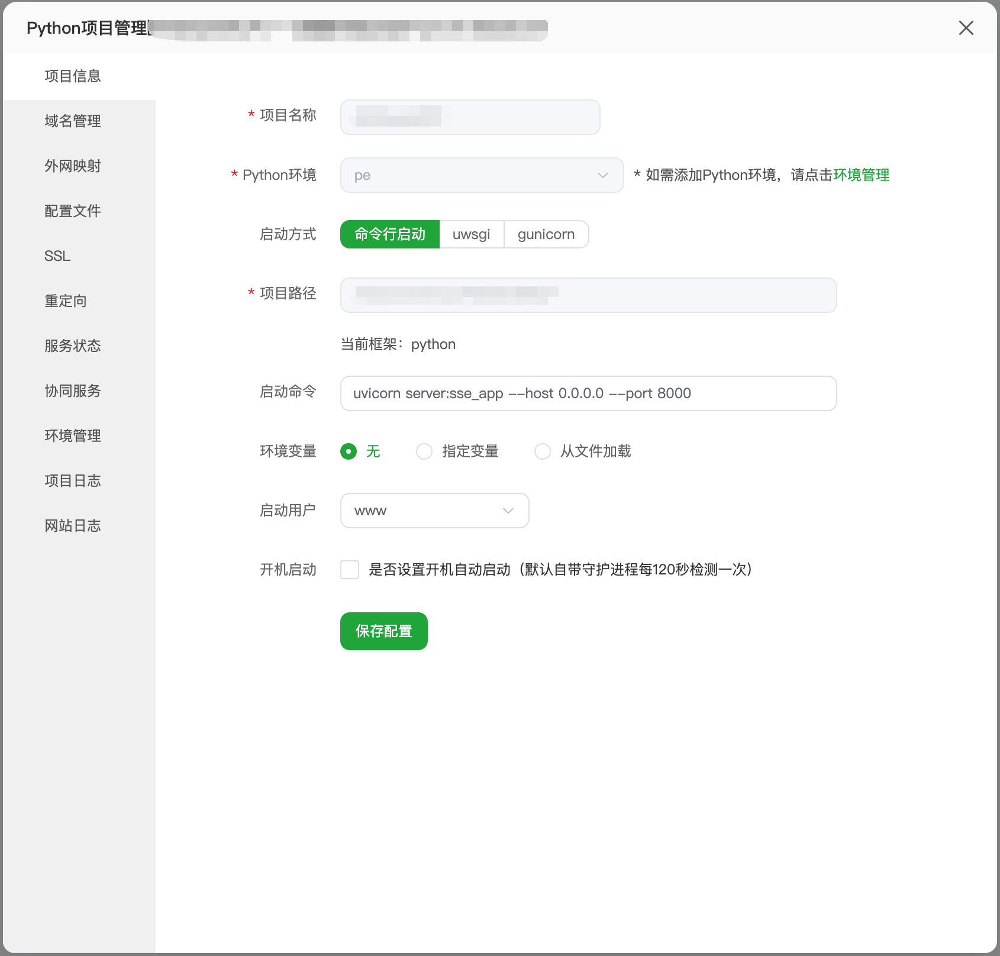

# MCP Demo 项目

## 项目介绍

MCP (Model Context Protocol) Demo 是一个基于 FastMCP 框架的示例项目，展示了如何构建一个提供天气查询、随机倍数生成和股票行情获取功能的服务。该项目使用通义千问作为客户端，通过 FastMCP 服务器提供的工具接口实现各种功能。

## 项目结构

```
MCP Demo/
├── README.md          # 项目说明文件
├── config.py          # 配置文件
├── requirements.txt   # 项目依赖
├── server.py          # FastMCP 服务器实现
└── tongyi_client.py   # 通义千问客户端
```

## 功能说明

### 服务器功能

服务器提供以下三个工具：

1. **get_current_weather**：获取指定城市的当前天气信息
2. **get_num_rand**：生成给定数字的随机倍数
3. **get_stock_quote**：获取指定股票的买卖盘数据

### 客户端功能

客户端使用通义千问 API，通过 MCP 协议调用服务器提供的工具，实现与用户的交互。

## 安装步骤

1. 克隆项目到本地：

```bash
git clone <项目地址>
cd MCP Demo
```

2. 安装项目依赖：

```bash
pip install -r requirements.txt
```

3. 配置 API 密钥：

编辑 `config.py` 文件，将 `api_key` 替换为实际的阿里云百炼 API 密钥。

## 使用方法

### 启动服务器

```bash
python server.py
```

服务器将在 `http://0.0.0.0:8000` 上运行。

### 运行客户端

```bash
python tongyi_client.py
```

客户端启动后，您可以输入以下类型的问题：

- "北京的天气怎么样？"
- "生成 5 的随机倍数"
- "获取股票 600000 的行情"

## 服务器部署

### 部署步骤

1. 上传项目文件到服务器
2. 配置服务器环境，确保安装了 Python 和必要的依赖
3. 配置域名，外网映射，SSL等
4. 启动命令：

```bash
uvicorn server:sse_app --host 0.0.0.0 --port 8000
```

### 服务器截图



## 技术栈

- **服务器端**：Python, FastMCP, Uvicorn
- **客户端**：Python, Qwen Agent
- **依赖库**：
  - akshare (1.18.14)：用于获取股票数据
  - fastmcp：MCP 框架
  - pydantic：数据验证
  - pandas：数据处理
  - uvicorn：ASGI 服务器

## 测试工具

您可以通过运行客户端来测试各个工具：

1. 确保服务器已经启动
2. 运行客户端：`python tongyi_client.py`
3. 输入测试问题，例如：
   - "上海的天气怎么样？"
   - "生成 7 的随机倍数"
   - "获取股票 600036 的行情"

## 注意事项

1. 确保已正确配置 API 密钥
2. 服务器需要保持运行状态，客户端才能正常调用工具
3. 股票行情查询需要使用正确的股票代码
4. 天气查询功能依赖外部 API，可能会受到网络影响

## 示例对话

```
user question: 上海的天气怎么样？
工具调用信息： {'name': 'get_current_weather', 'arguments': '{"city": "上海"}'}
工具调用结果： {"data": {"city": "上海", "date": "2026-02-26", "weather": "晴", "temp": "18℃", "humidity": "65%", "wind": "东北风 3级"}, "code": 0, "msg": "success"}
上海今天的天气是晴，温度18℃，湿度65%，东北风3级。

user question: 生成 7 的随机倍数
工具调用信息： {'name': 'get_num_rand', 'arguments': '{"num": 7}'}
工具调用结果： 49
7的随机倍数是49。

user question: 获取股票 600036 的行情
工具调用信息： {'name': 'get_stock_quote', 'arguments': '{"symbol": "600036"}'}
工具调用结果： [{"卖5价": 15.25, "卖5量": 1234, "卖4价": 15.24, "卖4量": 2345, "卖3价": 15.23, "卖3量": 3456, "卖2价": 15.22, "卖2量": 4567, "卖1价": 15.21, "卖1量": 5678, "买1价": 15.20, "买1量": 6789, "买2价": 15.19, "买2量": 7890, "买3价": 15.18, "买3量": 8901, "买4价": 15.17, "买4量": 9012, "买5价": 15.16, "买5量": 1013}]
股票600036的行情数据已获取，包括买卖盘价格和数量信息。
```
